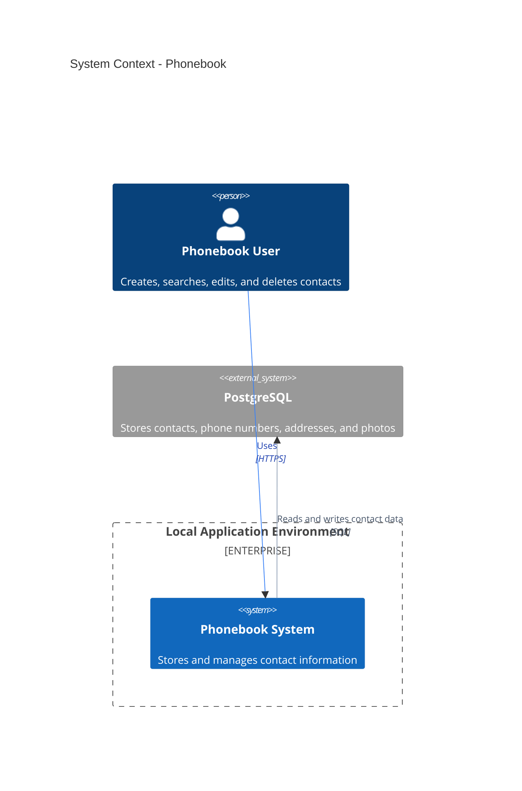
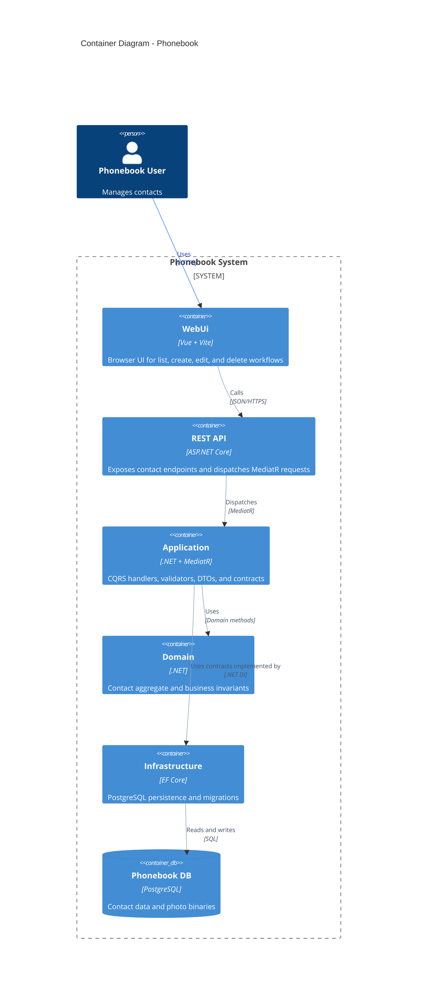
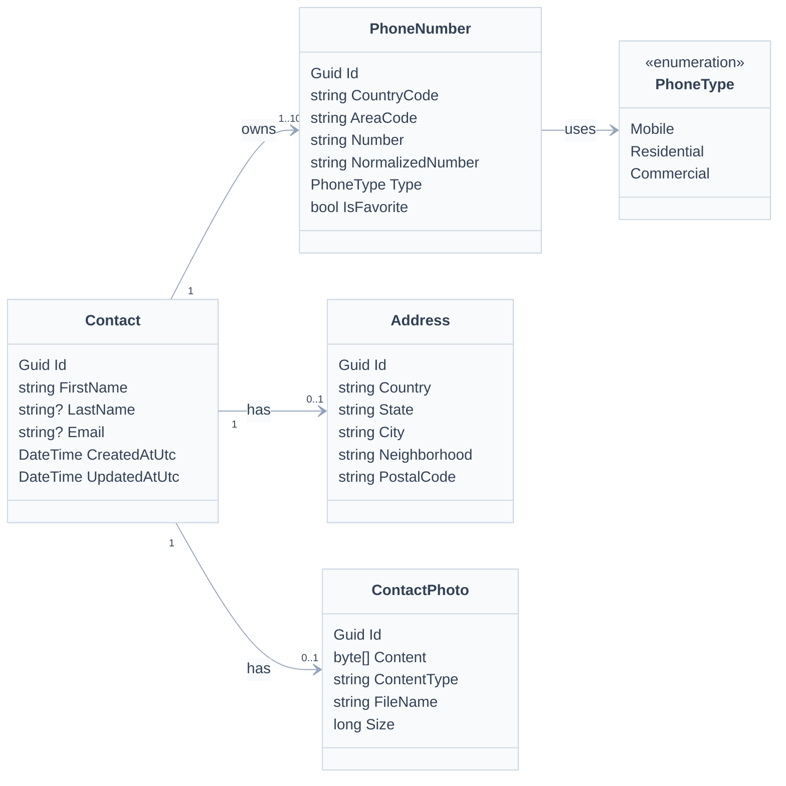
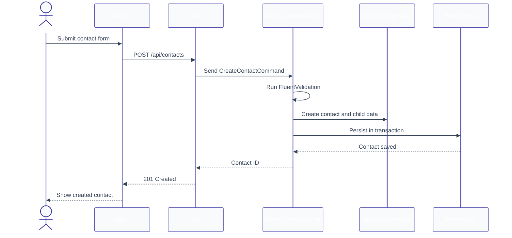

# Phonebook design

**Spec**: `.specs/features/phonebook/spec.md`
**Status**: Draft

## Architecture recommendation

Use a modular Clean Architecture solution with separate projects for domain,
application, infrastructure, API, WebUi, and tests.

This approach is the best fit because the feature has real domain rules,
application use cases, persistence constraints, browser workflows, and multiple
test layers. Keeping boundaries explicit prevents the REST API and Vue UI from
duplicating or owning business rules.

## Architecture options

| Option | Description | Trade-offs | Recommendation |
| --- | --- | --- | --- |
| Clean Architecture projects | Separate Domain, Application, Infrastructure, Api, WebUi, and test projects. | More project setup, but clear dependencies and test boundaries. | Choose this. |
| Single ASP.NET Core project with folders | Keep everything in one project and separate by folders. | Faster setup, but weaker boundaries and harder CQRS/test isolation. | Do not choose. |
| Backend API plus independent frontend only | Focus on API and Vue app without domain/application layering. | Simpler UI delivery, but conflicts with CQRS and architecture requirements. | Do not choose. |

## System context



## Container architecture



## Domain data model



## Create contact flow



## Project structure

```text
Phonebook.V2.slnx
src/
  Phonebook.Domain/
  Phonebook.Application/
  Phonebook.Infrastructure/
  Phonebook.Api/
WebUi/
tests/
  Phonebook.DomainTests/
  Phonebook.ApplicationTests/
  Phonebook.IntegrationTests/
```

## Component responsibilities

| Component | Location | Responsibility |
| --- | --- | --- |
| Domain | `src/Phonebook.Domain` | Contact aggregate, phone rules, address completeness, photo metadata rules, domain errors. |
| Application | `src/Phonebook.Application` | CQRS requests and handlers, DTOs, validators, persistence contracts, query projections. |
| Infrastructure | `src/Phonebook.Infrastructure` | EF Core `DbContext`, entity configuration, PostgreSQL migrations, repository/query implementations. |
| API | `src/Phonebook.Api` | REST controllers, request/response mapping, validation error mapping, OpenAPI in development. |
| WebUi | `WebUi/` | Vue screens, shared contact form, API client modules, browser validation feedback. |
| DomainTests | `tests/Phonebook.DomainTests` | Domain invariant coverage. |
| ApplicationTests | `tests/Phonebook.ApplicationTests` | Handler and validator behavior with test doubles where appropriate. |
| IntegrationTests | `tests/Phonebook.IntegrationTests` | EF Core, PostgreSQL, migrations, constraints, cascade delete, search, pagination, API behavior if hosted in-memory. |
| E2E tests | `WebUi` or `tests/Phonebook.E2ETests` | Playwright browser flows against API and WebUi. |

## CQRS use cases

| Type | Request | Result |
| --- | --- | --- |
| Command | `CreateContactCommand` | Created contact ID. |
| Command | `UpdateContactCommand` | No content or updated version metadata. |
| Command | `DeleteContactCommand` | No content. |
| Query | `GetContactForEditQuery` | Full editable contact DTO. |
| Query | `ListContactsQuery` | Paged contact list DTO. |

Queries must not call `SaveChangesAsync`, must use no-tracking projections, and
must not return EF entities. Commands may read data needed to validate and
execute the operation, but must not call query handlers.

## API surface

| Method | Route | CQRS request | Notes |
| --- | --- | --- | --- |
| `GET` | `/api/contacts` | `ListContactsQuery` | Supports `search`, `page`, and `pageSize`. |
| `GET` | `/api/contacts/{id}` | `GetContactForEditQuery` | Returns all editable fields. |
| `POST` | `/api/contacts` | `CreateContactCommand` | Creates contact and child rows. |
| `PUT` | `/api/contacts/{id}` | `UpdateContactCommand` | Replaces editable contact state. |
| `DELETE` | `/api/contacts/{id}` | `DeleteContactCommand` | Hard delete with cascade. |

## Persistence design

- Configure PostgreSQL through `PhonebookDbContext`.
- Configure `Contact` as the aggregate root.
- Configure `PhoneNumber`, `Address`, and `ContactPhoto` as dependent rows.
- Configure explicit cascade delete from `Contact` to dependent rows.
- Configure a filtered unique index for non-null email values.
- Configure phone uniqueness by contact using normalized phone fields.
- Store photo binary data only in `ContactPhoto`.
- Apply migrations in application deployment and integration-test setup.
- Integration tests must not use `EnsureCreated`.
- Integration tests must fail when migrations fail or model changes are pending.

## Frontend design requirements

The WebUi must follow `docs/design/DESIGN.md` and the project Web Interface
Guidelines:

- Use semantic form controls with visible labels.
- Provide inline validation errors and focus the first error on submit.
- Keep delete behind a confirmation modal.
- Sync search and pagination state to the URL query string.
- Provide accessible icon-only buttons with `aria-label`.
- Use stable avatar dimensions and fallback content when no photo exists.
- Keep reusable UI in `WebUi/src/shared/components`.
- Keep contact API access in `WebUi/src/features/contacts/api`.

## Error handling strategy

| Scenario | Handling | User impact |
| --- | --- | --- |
| Invalid command or query | FluentValidation returns HTTP 400 with field errors. | UI shows inline errors. |
| Missing contact | API returns HTTP 404. | UI shows not-found state or returns to list. |
| Duplicate email | Database and application validation reject the write. | UI shows email-specific error. |
| Duplicate phone within contact | Domain/application validation rejects the write. | UI shows phone-specific error. |
| Oversized photo | Validator rejects files over 750 KB. | UI shows photo-specific error. |
| PostgreSQL unavailable in integration tests | Test setup fails. | CI or local test run fails clearly. |

## Risks and concerns

| Concern | Location | Impact | Mitigation |
| --- | --- | --- | --- |
| Current project is only a Visual Studio API template. | `Program.cs`, `WeatherForecast.cs`, `Controllers/WeatherForecastController.cs` | There are no existing architecture conventions to reuse. | Establish Clean Architecture structure in the first implementation phase. |
| No `.git` repository is detected in this workspace. | Project root | Git index cleanup may not be possible. | Make Git cleanup tasks conditional on being inside a Git repository. |
| `docs/design/DESIGN.md` did not exist before this planning pass. | `docs/design/DESIGN.md` | Frontend design guidance was required but missing. | Add a design-system starter document before WebUi implementation. |
| Local PostgreSQL dependency can make integration tests environment-sensitive. | Integration tests | Tests may fail without a configured local database. | Require `PHONEBOOK_TEST_CONNECTION_STRING` and fail fast with a clear message. |

## Tech decisions

| Decision | Choice | Rationale |
| --- | --- | --- |
| CQRS mediator | MediatR | User-selected and common for .NET CQRS. |
| Validation | FluentValidation | User-selected and keeps request validation explicit. |
| Database | PostgreSQL | User-selected persistence target. |
| Integration test database setup | Recreate database and apply EF Core migrations | Verifies migrations and avoids Docker. |
| Frontend app | Vue + Vite under `WebUi/` | User-selected UI stack and location. |
| E2E runner | Playwright | User-selected browser test tool. |
